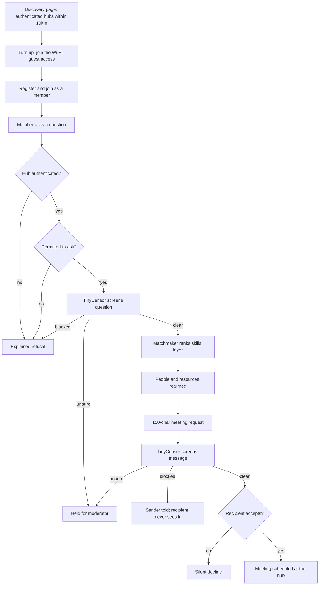
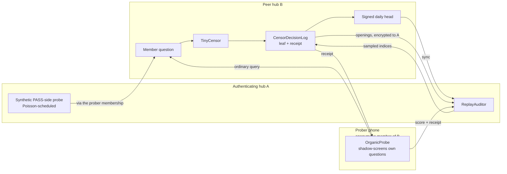
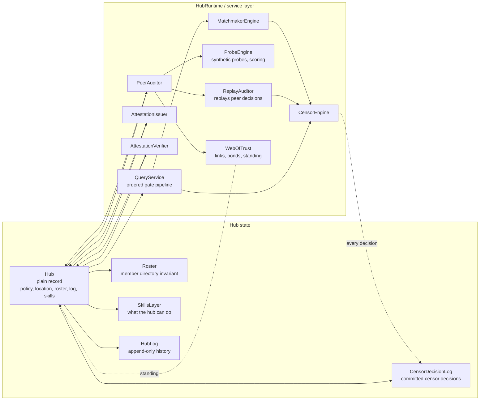
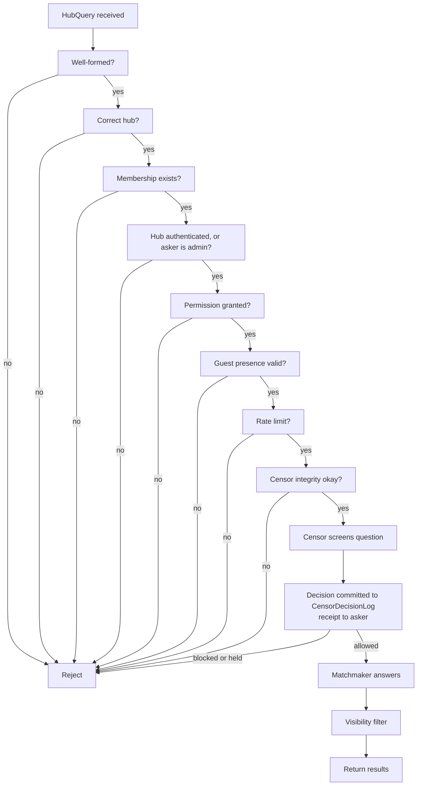

# Shalim

A knowledge discovery and redundancy mobile app.

Shalim connects knowledge communities — libraries, makerspaces, mutual aid
groups, community gardens — and keeps them working when the internet does not.
Each community runs a **hub**: a self-contained index of what its members and
its resources can actually do. When someone needs help, they ask their hub, and
the hub answers from within itself. No server is required, and nothing stops
working during a blackout.

---

## ⚠️ Status: skeleton only — this does not run

**This repository contains no working code.** Every method body is empty or
holds pseudo-code in comments. It compiles; it does nothing.

- No models are bundled or integrated. `TinyCensor`, `QwenMatchmaker` and
  `TinyProber` are interface implementations with no inference behind them.
- No Android project, no Gradle build, no UI, no persistence.
- No transport is implemented — Wi-Fi, cellular, Bluetooth and LoRa are
  described by capability, not spoken.
- **None of the safety controls below are enforced.** They are designed, not
  built. Do not deploy this near real users.

The skeleton exists to settle architecture — who can see what, what travels
between hubs, what happens when the network dies — before any of it is
implemented.

---

## The idea

A member opens a chat with their hub and asks something ordinary:

> *"I want to start a permaculture garden on my balcony. Who can help?"*

The hub screens the question, matches it against its **skills layer**, and
returns people and resources that fit — a neighbour who learnt grafting in the
orchard workshop, a book on the shelf, a wormery in the back room. The member
can send one short message to anyone the query returned, and if that person
accepts, they meet at the hub.

Skills come from resources. Every hub starts with an explicit list of what it
holds; the Matchmaker derives the hub's **hub skills** from that list, and
those are what strangers see in hub search. People earn **user skills** by
using those resources, verified by an admin, and carry them on their own
device to every hub they belong to.

That is the whole product. The complexity below exists to make it safe.

## How it fits together



## Prober changes (30 September 2026)

The previous revision had one weakness it could not design around: **the hub
being checked knew who was checking it.** It had to. The prober sent a request
to buy drugs or weapons every day, and without being told who they were, the
hub would have restricted them within a week. `PeerAuditor.isInboundProber`
existed to grant that exemption — and it was exactly the hook a dishonest hub
needed to answer the prober correctly and everyone else however it liked.
Knowing the prober also made authentication a lever against a named person.

This revision removes the need for the target to know. It does that by
no longer sending supply requests at all, then making the prober anonymous,
then making what remains of probing look like ordinary use.

### What changed

| | Before | Now |
| --- | --- | --- |
| **How the censor is tested** | Daily synthetic probes, one designed to be blocked | **Replay**: the peer commits every censor decision to a signed Merkle tree (`CensorDecisionLog`); the auditor opens a random sample and replays it through its own pinned TinyCensor (`ReplayAuditor`) |
| **Supply requests sent to peers** | One a day, every day | **None, ever.** `TrustProbe.sendableToPeer()` is false for `SUPPLY_SIGNAL`; those seeds are used for local self-test only |
| **Who the target thinks the prober is** | A named member, registered by user id | **An anonymous ordinary member.** The prober presents a `MemberCredential` (BBS) proving "ordinary, attested, joined ≥ 14 days ago"; the target records a pseudonym |
| **Moderation exemption for the prober** | `isInboundProber` | **Deleted.** Nothing the prober sends needs one |
| **Rate limiting the prober** | Per user id | **`EpochNullifier`** (RLN-style): one presentation per member per link per day; a second one mathematically reveals the member |
| **Shared-admin check** | Salted hashes — which let the target hash every member and name the prober | **`AdminOverlapCheck`**: private set intersection *cardinality*; the target learns only a count |
| **Device attestation** | Sent at link setup, naming the prober's key | Checked **at join** for every member who can attest; carried as a hidden credential attribute |
| **Behavioural probes** | Fixed daily pair | **Organic** (the prober's own real questions, shadow-screened on their device, `OrganicProbe`) plus **synthetic PASS-side** probes at a **Poisson** rate scaled to the peer's traffic |
| **Quiet or small hubs** | Probed like any other, so probes stood out | **`REPLAY_ONLY` mode**: below a traffic band, or below 8 eligible members, no questions are sent at all |
| **Plaintext on the auditor's device** | A fortnight of drug-request texts (as hash + seed) under the admin's identity | No supply text at all; replayed member questions are decrypted, replayed and discarded in one call |

### The three evidence streams



1. **Replay (every link, every day).** B signs a head for each day's tree.
   A reveals a nonce it committed to at link setup, derives sample indices
   from `PRF(root ‖ nonce)`, and B opens those leaves — plaintext encrypted to
   A only. A replays each through its own pinned TinyCensor. Because the model
   is deterministic and B committed before the sample existed, one mismatch
   beyond tolerance is near-proof, not a statistic. This is now the **only**
   test of under-blocking. It does not depend on B being fooled, so it is fine
   that B knows *A* is replaying it.
2. **Organic (FULL links).** The prober's device screens their own outgoing
   question with its local pinned TinyCensor, keeps B's receipt, later checks
   the receipt is in B's tree, and forwards only the score and receipt to A.
   A checks the receipt against the head *it* was given. This catches the two
   things replay cannot: screenings routed around the log, and B showing
   different auditors different trees. Every member's device checks its own
   receipts routinely, so the prober doing so marks no one out.
3. **Synthetic (FULL links).** Benign, protected-speech and near-miss probes
   only, weighted to protected speech. Their job is now narrow: over-blocking
   of harm-reduction, abortion-access and border-safety questions, which a
   prober's own questions rarely touch. Sent at exponentially distributed
   intervals with a mean of ~2% of B's traffic (max 3/day), inside the
   prober's usual active hours — so some days have none, like any member.

### How a link is set up now

1. A's admin, an ordinary member of B for at least 14 days, asks to set up
   authentication.
2. A and B run `AdminOverlapCheck`. B learns only whether they share an admin.
3. The admin's device presents today's `MemberCredential` for B. B verifies it
   against its own issuer key, checks the nullifier, and checks the member is
   not already carrying a link for another hub (the prober pseudonym).
4. B records an inbound link under a **link pseudonym**. No user id exists
   anywhere on B's side.
5. If B has fewer than 8 ordinary, attested, old-enough members, the link runs
   `REPLAY_ONLY` and nothing is ever sent under the admin's membership.
6. Credentials expire daily and are never issued to admins, so promotion to
   admin in B ends the link the same day, as before.

### Mode selection

| Condition | Mode | What runs |
| --- | --- | --- |
| B's anonymity set ≥ 8 and traffic band ≥ 2 (≈ 64 padded screenings/day) | `FULL` | Replay + organic + synthetic |
| B's anonymity set < 8 | `REPLAY_ONLY` | Replay, reduced to a small weekly sample |
| B's traffic band < 2 | `REPLAY_ONLY` | Replay |
| `HIGH_RISK` posture | `FULL` without synthetic (anonymity threshold 12) | Replay (batched weekly over sync) + organic |

### What is still exposed

- **B knows *some* member probes for A.** It does not know which. In a hub at
  exactly the threshold, eight people is a small crowd.
- **Replay reads real member questions.** A sample of B's members' questions
  is decrypted on A's hub instance. The text never contains a user id, is
  never displayed or stored, and the sample is fixed by the root and a
  pre-committed nonce so A cannot aim it at one person — but in a small hub a
  question can identify its author on its own content.
- **Meeting requests are not replayed** by default (`HubPolicy.replayMeetingRequests`).
  They are private messages between two members. Their screening is checked
  only through receipts.
- **Determinism is an engineering commitment.** Replay requires every hub to
  screen on the reference CPU backend with fixed threading. Leaves within
  ±0.005 of a threshold are excluded from findings.
- **Attestation now reaches every member who can attest**, not only probers.
  Members who cannot attest lose nothing except the ability to be a prober.

## Current architecture boundary

The core structural refactor is now: `Hub` is plain state, and runtime machinery lives elsewhere.

- `Hub` holds only durable hub state: its id, name, description, policy, location, network, log, skills layer and `Roster`
- `HubRuntime` is the process-local service container that owns the runtime engines: censor, matchmaker, prober, issuer, verifier and auditor
- `HubStanding` is observed state, like `CensorIntegrity`: computed from the hub's authentication links, held on the hub, read by the query path
- `Roster` owns membership state and roster invariants instead of leaving the directory as an implicit list in a god object
- `QueryService` runs the ask pipeline as an ordered list of gates, short-circuiting on the first rejection

This is the key design rule behind the split:

> Services depend on state; state never depends on services.

That matters because a `Hub` that holds a live ML model, a running censor, or a loaded transport stack is no longer serialisable, syncable, or safe to reason about as data. Once the state is pure, replication and persistence become straightforward; the runtime can be reconstructed at startup without mutating hub identity.

A hub therefore acts like a record plus a service layer, not a single object doing both the describing and the deciding.

## How to think about the split

The easiest way to understand this architecture is to separate two questions:

- What is this hub? That is the durable data: its identity, policy, premises, membership list, log, and the skills it holds.
- What can happen to this hub right now? That is the runtime layer: the model that screens questions, the engine that ranks matches, the proof issuer, the auditor, and the other service objects that act on the hub.

In other words, the hub record answers “what is this thing?” while the runtime answers “what does this thing do?”

That distinction matters because the safety design relies on being able to copy, persist, and reason about the hub as data without dragging in a live ML model, network stack, or auditing engine. Once you mix those together, one object becomes both the dataset and the machinery, and the architecture quickly collapses into a god object.

## Next refactor steps

The project is now intentionally doing the architecture in small, buildable slices. The next logical steps are the ones you described in order, and each one is meant to stand on its own before the next is added:

1. `Roster` is already separated; the next work is to keep extracting the membership and admission logic into a dedicated `Admissions` service.
2. Pull the query-time behavioural logic behind a `MeetingService`, keeping meeting-request retention and moderation adjacent to the request lifecycle.
3. Move moderation and censor-integrity decisions into their own service classes instead of leaving them on the hub object.
4. Move discovery card generation behind a simple publisher-like class rather than a hub method that both describes state and decides what to publish.
5. Delete the trust and discovery pass-throughs so the hub package no longer depends on auditing or card-building logic in a way that hides the real architecture.
6. Add a couple of architecture tests around the query gate order and the requirement that a gate list without the censor screen gate cannot be constructed.

This is deliberately incremental: the goal is not to make the whole system “smart” at once, but to make the safety boundaries explicit enough that they can be reasoned about and tested.

## Architecture diagram



This is the key separation: the hub record contains durable state; the runtime layer contains the engines and services that act on that state. A service may ask the hub for data, but the hub never imports or owns the service itself.

## Query gate pipeline



This is the important safety property: the query path is a pipeline, not a loose set of checks. The first rejection wins, and the expensive model work happens only after the cheap/obvious gates pass. Every screening is committed to the `CensorDecisionLog` before its result is acted on, so no answer — or refusal — leaves the hub without a leaf another hub can later replay.

## Packages

| Package | What lives there |
| --- | --- |
| `org.shalim.hub` | Plain state (`Hub`), runtime container (`HubRuntime`), `Roster`, `QueryService`, `HubStanding`, append-only `HubLog`, the committed `CensorDecisionLog`, policy and premises |
| `org.shalim.identity` | `User` and per-hub `Membership`, with `Role`, `Permission`, `Restriction`, `AgeAssurance` |
| `org.shalim.skills` | Resources and the hub skills derived from them; earned `UserSkill`s, their `SkillCredential`s and the user-held `SkillProfile`; the private member skill index |
| `org.shalim.ml` | `CensorEngine`, `MatchmakerEngine` and `ProbeEngine` interfaces, their implementations, and model pinning |
| `org.shalim.query` | Asking, answering, meeting requests, meetings, and query-gate primitives |
| `org.shalim.transport` | Wi-Fi, cellular, Bluetooth mesh and LoRa, plus sync |
| `org.shalim.attestation` | Portable proofs of good standing and person-level moderation outcomes |
| `org.shalim.trust` | Authentication of other hubs — replay (`ReplayAuditor`), organic and synthetic probes, anonymous prober credentials (`MemberCredential`, `EpochNullifier`, `AdminOverlapCheck`), difference scores, the probe ledger, links and bonds |
| `org.shalim.discovery` | The landing page: authenticated hubs near you, and the hub skills each offers |

## Design decisions worth knowing

Most of these were arrived at by asking what the design does to someone it is
supposed to protect.

**There is no member directory.** Ordinary members cannot browse the hub. You
can only message someone a query of *yours* actually returned, and only once —
a decline is silent and final. Without this, the safety controls are decoration
around a searchable list of strangers.

**Roles are per hub, not per person.** The same person can be an admin in one
hub and a guest in another. Role lives on `Membership`, so promotion never
means replacing a `User`.

**Restrictions cap, they do not accumulate.** A `Restriction` lowers the
effective `Role` and permissions derive from the capped role, so no stray
privilege survives a demotion. Every restriction is explained to the person it
affects, and nearly all are appealable.

**Screening happens at write time, not just read time.** A dangerous skill
listed in the skills layer never passes through a query, so it is screened when
it is added or it is never screened at all.

**Blocking is the last resort.** The censor's job is to catch supply and
coordination of a short list of harms — not to police tone. A hub discussing
overdose response, abortion access, or crossing a border safely must pass. Text
the model is unsure about goes to a human, not to a silent block.

**Uniform screening without a central chokepoint.** Every hub runs the same
censor *artefact*, verified locally by hash (`ModelPin`), rather than calling a
shared service. A shared service would stop working in a blackout and would
give someone a lever to pull.

**Discovery runs on your device, not on anyone's server.** The landing page
shows hubs within 10km and up to five things each is good at. A hub's location
is its own decision, redacted at source to its declared precision. The
*searcher's* location is not the hub's business at all, and there is no service
to send it to — `HubDirectory.search` takes a coordinate, matches it against
cards already replicated by ordinary sync, and makes no network call, because
the class holds no transport. A hub is never told it was found, never told who
looked, and never told anyone searched. Distances are rounded to 500m before
anything can read them, since three precise distances intersect at an address.

**Hub search shows hub skills; people search shows user skills.** A hub
starts with an explicit list of resources, and QwenMatchmaker derives the hub's
skills from them. Those — up to five — are what a stranger sees on the card,
and because they describe a lathe or a seed library rather than a person they
need no anonymity floor. (The earlier design built themes from member skills
and needed a five-distinct-people floor to stop a theme resolving to one person
in a small hub; that machinery is gone because nothing person-derived reaches
the card.) When a member asks their hub "who can help me with X?", the
Matchmaker searches a separate, private index of the **user skills** members
have presented there — including skills earned at other hubs.

**Skills are earned from resources, and travel with the person.** Anyone,
guests included, can log use of a hub resource. An admin verifies it, and the
hub issues a `SkillCredential` to the person's device. The credential is
ring-signed over the keys of all listed hubs in the region, so a hub the person
later presents it to can check that *some* authenticated hub issued it without
learning *which* — otherwise every portable skill would disclose a membership.
It carries a coarse shared taxonomy term, not the issuing hub's own label, and
a day-granular date. The receiving hub verifies it, imports the term into its
member index, and throws the credential away. An unauthenticated hub's key is
in no ring, so it cannot issue portable credentials: interactions logged there
wait until it is authenticated. Self-declared skills no longer exist.

**You can only authenticate a hub where you are an ordinary user — and the
hub is not told which user you are.** An admin carries probes into another hub
through a membership there that is MEMBER or MODERATOR, never ADMIN, and the
two hubs may share no admin. The target checks this without learning who the
prober is: every ordinary member holds a daily anonymous `MemberCredential`
that admins are never issued, and the prober presents it; admin overlap is
checked by private set intersection cardinality, so only a count crosses. A
member must have belonged for 14 days before presenting, so a link cannot be
traced by when someone joined, and each member can carry a link for one
auditing hub only. Credentials expire daily, so promotion to admin ends the
link the same day — which is not a finding about either hub's censor.

**One device, one account.** A device holds at most one user account, in a
single hardware-keystore slot (`DeviceBinding`); a guest identity occupies the
same slot, and someone with an account walks into a hub under it rather than
as a second, guest identity. Hub instances are not accounts: an admin can keep
their account on a phone and run the hub on a desktop. The rule is verified by
key attestation, checked offline against bundled platform roots, proving a
hardware-backed key made by a genuine Shalim release on a device with verified
boot. It carries no device identifier. Attestation is now offered **at join**
by every member whose device supports it and carried as a hidden credential
attribute, rather than requested at link setup — where it used to name the
prober. Together these stop an admin of several hubs from bonding them with a
second account on the same phone. They do not stop someone with several
phones, or several people acting together.

**One hub per network.** Guest access already depends on being on a hub's
network, so each hub claims its network and no other hub may be created on it.
A "network" is the set of access points (BSSIDs) in the hub's space, not an
SSID, so two hubs on different access points of one building are fine, and a
randomising phone hotspot cannot hold a claim. There is no registry: a running
hub answers claim queries on its own network, and hub creation listens for ten
minutes and checks the creating device's own pinned claims before any keys are
made. Because a hub instance must be on the network it claims, one device can
host at most one hub per network it is attached to. Claims never leave the
premises as comparable identifiers — a list of BSSIDs geolocates to buildings —
so members' devices pin their hub's claim when they join, and bonded peers
witness only its id and date.

**Displacement is refused while a hub is live and contained when it is
not.** If an adversary takes a hub's device offline and creates a lookalike on
its network, the rightful hub finds the dispute when it returns. Members'
devices keep following the hub they pinned, however the newcomer's claim is
witnessed. A walk-in gets guest access from neither disputing hub, and a
disputed hub is not listed until one side migrates. An adversary who controls
the network itself can still replace the router; the hub then moves with a
migration signed by its own key, which members' devices follow.

**Every hub has premises, a network, an admin and a bounded roster.** A
`HubLocation` with a real address, published at whatever precision its members
consented to — exact, street, district, or not on the map at all. A
`HubNetwork`, normally the hub's Wi-Fi, where being attached is what makes a
walk-in a guest: the building is the credential, it expires when they leave, and
it never grants `RUN_HUB_QUERY`, so nobody on the café Wi-Fi can ask who is
here. At least one admin, because a hub nobody can moderate is worse than no
hub. And a member roster reachable only through `moderatorRoster`, alongside a
log of meeting requests kept for a fortnight and then dropped with their
messages.

**Hubs check each other's censors by replaying their decisions, not by
asking for drugs.** Every hub commits each censor decision to a daily signed
Merkle tree (`CensorDecisionLog`) and gives the asker a receipt. An
authenticating hub opens a random sample the peer could not predict and
replays it through its own copy of the pinned TinyCensor. The model is
deterministic, so a mismatch is proof rather than a statistic, and no harmful
question is ever sent to test anything. Two lighter streams sit beside it —
see *Prober changes* above:

- **Organic probes** are the prober's own real questions, screened on their
  phone before sending and checked against their receipt afterwards. They
  catch a hub that routes traffic around its log or shows auditors a
  different log from the one it served.
- **Synthetic probes** are generated PASS-side questions — benign, protected
  speech, near-miss — paraphrased from pinned seeds, sent at a Poisson rate
  scaled to the peer's traffic. Their only job is over-blocking. Fresh wording
  stops a peer memorising the corpus; inherited intent stops a retuned hub
  writing probes that agree with its retuning.
- Quiet hubs and hubs with fewer than 8 eligible members get **replay only**:
  a probe cannot hide where there is nothing to hide in, but a decision log
  exists at any size.
- Only censor behaviour is ever compared — decision, categories, confidence,
  refusal wording. Matchmaker answers are not comparable across hubs, and
  reading them would turn auditing into member harvesting.

RoBERTa cannot generate text, and TinyCensor is already a RoBERTa. The
reference `TinyProber` is a small decoder for paraphrase plus a RoBERTa-class
encoder for scoring. Replay needs neither; it uses TinyCensor itself.

**Revocation is decided over a window, attributed, and slow.** `WebOfTrust.assess`
reads the ledger over the same fortnight that meeting requests are kept.
Replay mismatches, split or broken decision logs, and unlogged receipts are
conclusive on a single verified instance; over-blocking from synthetic probes
is statistical (p < 0.01), with organic scores able to corroborate but never
carry it alone. If the evidence points at *this* hub — including replays made
against a local censor on a different release — it raises a finding against
its own censor instead. A failing window moves a link to `SUSPENDED` (it still
counts); only fresh failure on a later day's evidence revokes it. A revocation
removes one link toward one hub and cannot cascade. Links with no scoreable
evidence for a week — a blackout, no heads arriving — go `DORMANT`, which is
not a revocation.

**The audit trail holds no plaintext.** The `ProbeLedger` keeps each replayed
leaf as the peer's signed hash and this hub's verdict, each synthetic probe as
hash and generation seed (regenerated for an appeal), and each organic probe
as its score alone, for exactly as long as meeting requests. There is no
supply-request text on any admin's device any more. Peers are recorded by key
fingerprint, never hub id; inbound probers by pseudonym, never user id.

**New hubs start guest-only.** A hub nobody has checked caps every member
except its admins at `GUEST` (`HubStanding`): they can use resources and earn
skills, but cannot use the Matchmaker or request meetings. It is unlocked when
an admin sets up authentication with a hub they are a member of and that link
passes its first window. Once unlocked, a hub re-locks only if *every* inbound
link is positively revoked — never because links went quiet, since that is
what a blackout looks like and the design does not take the Matchmaker away
when the network is down. Members of a locked hub are told the hub "hasn't
been checked yet", never that another hub found fault.

**Search shows only mutually authenticated hubs.** A *bond* is two hubs each
currently authenticating the other. Hub search hides hubs with fewer than two
bonds by default; the searcher can choose 1 to 5, never 0. A hub that
authenticates others but is not authenticated back has no bonds and never
appears; its admin fixes this with a `ReciprocityInvite`, which carries a
membership invitation (the peer's admin must join, and wait 14 days, to probe
it) and a request to
authenticate back. A hub below threshold can still be opened from a link or a
poster code. Bonds are published on the card as `BondProof`s: linkable ring
signatures that prove "*n* distinct listed hubs are bonded with this one"
without saying which, verified on the searcher's device against cards it
already holds.

**The 150-character cap is not a substitute for screening.** Brevity limits
grooming, which needs rapport and therefore room. It does nothing about dealing:
"Purple Haze, 50 an eighth, can drop Thursday" is under sixty characters and
carries strain, price, quantity and delivery. So every meeting request goes to
`TinyCensor` at `Surface.MEETING_REQUEST` — the hardest thresholds of any
surface — and `isScreened()` gates delivery, so a path that skips the censor
produces an undeliverable request rather than an unscreened one that arrives.

**Hubs prove good standing; they do not carry marks.** A hub whose censor is
compromised simply stops vouching for its members, and their short-lived proofs
lapse. Other hubs see "no current proof" — never *which* hub failed, or that a
person belongs to it. This is deliberate: a cross-hub membership graph is the
single most dangerous thing this design could accidentally build.

**Absence of proof fails open during a blackout.** When nobody can refresh a
proof, a missing one costs nothing. Treating absence as guilt would silence the
network exactly when it matters most. A patient bad actor can wait out an
outage; that trade is made knowingly.

**What follows a person is a human decision, not a model's.** Cross-hub
consequences come from `ModerationOutcome` — evidenced, expiring, appealable,
and shared only if the issuing hub opts in. Hub-level censor failure is a poor
proxy for a dangerous person: it punishes an innocent hub's whole membership,
while real predators operate in hubs whose models work fine.

**Admins see more, and are watched for it.** `moderatorRoster` is the only path
to a member list, and every call is logged. An infiltrated hub's weakest point
is an admin account.

**Meetings happen at the hub.** The venue comes from the hub, never from user
input, so no code path can send someone somewhere private. This stops
venue-based luring; it does not stop someone being charming in person and
moving the conversation off-app, which is why the contact controls above matter
more.

**Age assurance is a per-deployment choice.** Proving your age means
identifying yourself, and identification is the danger in a repressive setting.
A library hub can require it; a hub under an internet kill switch cannot be
asked to. `HubPolicy.Posture` makes the choice explicit and discloses it before
anyone joins.

**Transports differ by orders of magnitude, and the code knows it.** LoRa
carries a heartbeat or one 150-character meeting request — not a sync. Falling
back from Wi-Fi means doing *less*, not the same thing slower.

**Degraded answers say so.** When no model is available, ranking falls back to
keyword search and results are marked as such, so nobody mistakes a word match
for a judgement.

## Threat model

Shalim assumes bad actors will try to use it, and that some of them are the
authorities.

| Threat | Primary controls |
| --- | --- |
| Drug and weapons supply | Write-time and query-time screening, narrow harm categories, no off-app contact details |
| Radicalisation across hubs | Person-level `ModerationOutcome`; evidenced, expiring, appealable |
| Grooming and trafficking | No browsing, query-gated contact, 150-char cap, silent decline, consent before scheduling, meetings at the hub, guest-capped minors |
| Hostile state or police | On-device models, no central service, key-based identity, per-hub restriction scope, bounded log retention, ring-signed bond proofs and skill credentials, probe ledger without plaintext, anonymous probers known only by pseudonym |
| A hub quietly compromised or retuned | Replay of committed censor decisions through the pinned model; member receipts against split or incomplete logs; Poisson-timed PASS-side probes for over-blocking; attributed, decided over a fortnight window with a suspension step |
| A hub special-casing its auditors | Prober anonymous among ≥ 8 ordinary members; no moderation exemption to key on; organic probes indistinguishable from use; replay does not depend on the hub being fooled |
| A new hub set up to farm credentials or reach members | Guest-only until authenticated; cannot issue portable skill credentials; absent from search until bonded |
| Mapping a community from its public page | Per-hub location precision, public skills derived from resources only, bond counts without bond partners, no member counts or activity signals, on-device search |

Known unresolved — see *Open design questions* below for the full list. The
short version: a peer now knows only that *some* member probes it, but in a
small hub that is a small crowd, and replay decrypts a sample of real member
questions on the auditor's hub; revocation is now a lever a hostile
bonded hub can pull; bond counts measure hubs, not independent people; and
on-device discovery still means a seized phone holds a list of nearby hub
cards, which is why cards are pruned and panic-wiped.

## Open design questions (September 2026 revision)

Updated 30 September for the prober changes: question 2 is largely addressed,
4, 7 and 11 have moved, and 15–20 are new.

The September revision (daily probing, guest-only new hubs, bond-gated search,
resource-derived skills) changed several rules the earlier design had called
load-bearing. These are the places where the new rules and the older reasoning
do not fit cleanly. Each is marked in the code where it bites.

1. **Authentication is now a sanction, so it can be weaponised.** The old
   design survived a hostile hub because a withheld vouch did nothing. Now a
   revoked link can drop a hub below the search threshold and, if it was the
   only inbound link, re-lock its members. A state hub that has bonded with a
   community can do this. Mitigations in place: attribution against the pinned
   corpus, suspension before revocation, one link per revocation, appeal while
   evidence is retained. Not mitigated: a hub with only one or two bonds is
   exposed to any one of its peers.
2. **Probes are no longer hidden — largely addressed.** The peer used to
   know the prober's key, and `PeerAuditor.isInboundProber` existed so it would
   not restrict an admin who asked to buy drugs daily; that hook was all a
   dishonest hub needed to special-case probes. Now no supply request is sent,
   `isInboundProber` is gone, the prober is anonymous (`MemberCredential`,
   `EpochNullifier`, `AdminOverlapCheck`), and the censor is tested by replay,
   which works even when the hub knows who is auditing. Residual: the peer
   knows *some* member probes for a given hub; a hub could behave well towards
   all members and badly only towards guests (who cannot query); and a hub
   that correctly guesses the prober from context can still special-case
   organic and synthetic probes — though not replay.
3. **The cross-hub graph is partly published.** Mutual authentication requires
   each hub's admin to be a member of the other, and search requires the count
   to be public. Ring signatures hide *which* hubs are bonded, but anonymity is
   only as large as the ring — in a region with four listed hubs it is small —
   and the count itself says something about a hub's organisers.
4. **Sybil hubs.** Partly addressed. An admin can no longer authenticate a hub
   they admin, hubs sharing an admin cannot bond, one device holds one
   account, and each ordinary member can now carry a link for **one** auditing
   hub only (prober pseudonym). Still open: one person with several phones, a
   group acting together, or an admin who recruits a friend — now one friend
   per hub rather than one friend for all of them. One hub per network limits a
   device to one hub per network it is attached to, but a £20 router is a new
   network. This raises the price of fake hubs; it does not make it high.
5. **Which direction unlocks a new hub.** As specified, an admin authenticating
   *another* hub unlocks their own. But an outbound link is evidence about the
   peer's censor, not this hub's; a hub with a tampered censor can unlock itself
   by auditing someone honest. `HubPolicy.UnlockBasis` offers `ANY_DIRECTION`
   (as specified) and `INBOUND_REQUIRED` (recommended).
6. **Bootstrapping.** The first hubs in a region have no one to authenticate or
   be authenticated by, and an admin with no membership in an authenticated hub
   can never unlock theirs. Needs a genesis rule — e.g. release-signed initial
   bonds, or a time-limited grace for the first *n* hubs.
7. **HIGH_RISK hubs — improved.** Previously they did not audit, because
   regular traffic between two hubs is itself a signal; then they had to, with
   a daily rhythm. Now HIGH_RISK links run replay batched weekly over sync that
   happens anyway, plus organic probes that are questions the prober was
   asking regardless, and no synthetic probes. The remaining signal is the
   weekly opening exchange. An unlisted-hub exemption with a release-signed
   unlock token is still worth considering.
8. **Self-declared skills are gone.** The neighbour who has grafted fruit trees
   for thirty years has no resource to earn it from. Either hubs list
   "mentoring" resources, or unverified declared skills return, labelled and
   ranked lower.
9. **Admins verify every skill.** A bottleneck, and one more record of who did
   what in the hands of the account the design already calls an infiltrated
   hub's weakest point. `VERIFY_EARNED_SKILL` could extend to moderators.
10. **Rare skills identify hubs.** A credential for "glassblowing" in a region
    with one glassblowing hub names the hub whatever the ring says. The shared
    taxonomy should be coarse enough that terms are held by several hubs.
11. **Device attestation has costs — and now wider reach.** It relies on
    Google's and Apple's attestation roots (bundled and checked offline, but
    still their roots) and excludes custom ROMs without verified boot and
    modified AGPL builds. To stop attestation naming the prober, it moved from
    link setup to join, so it now touches every member whose device offers it,
    not only probers. Members who cannot attest lose nothing but the ability to
    probe. For HIGH_RISK hubs this may still be unacceptable; such hubs could
    disable attestation and accept that their members cannot carry links.
12. **Shared premises.** A community centre hosting three groups on one set of
    access points can now hold one hub, not three. They share a hub, or each
    runs its own access point.
13. **Claim answers reveal a hub.** Anyone on a network can ask whether a hub
    claims it. For walk-in hubs that was already visible; for invitation-only
    hubs it is new.
14. **Credential revocation.** Because the issuer is hidden, a hub later found to
    have minted credentials fraudulently cannot have its credentials revoked
    individually. They can only age out.
15. **Replay reads real questions.** A sample of the peer's members'
    questions is decrypted on the auditing hub's instance. No user id is
    attached, nothing is displayed or stored, and the sample cannot be aimed —
    but in a small hub content alone can identify an author. Mitigated by
    `REPLAY_ONLY`'s small weekly sample below 8 members; not eliminated.
    Zero-knowledge proofs of inference would remove this and are not yet
    practical on phones.
16. **Meeting requests are unreplayed.** Opening a private message between
    two members to another hub was judged too intrusive, so the
    `MEETING_REQUEST` surface — the one the censor treats hardest — is checked
    only through receipts, not by replay. `HubPolicy.replayMeetingRequests`
    exists for hubs that decide otherwise.
17. **Deterministic inference is a hard requirement.** Replay works only if
    every hub screens on the reference CPU backend with fixed threading. NNAPI
    or GPU paths would make honest hubs fail. The ±0.005 tolerance and the
    threshold exclusion band absorb drift, but need measuring on real devices
    before the numbers are trusted.
18. **Scheme choice and Java support.** BBS with per-verifier pseudonyms,
    RLN-style nullifiers and DH-based PSI-CA are all specified here in
    outline. Mature libraries are in Rust and Go; the plan is JNI. None is
    chosen.
19. **Traffic bands are self-reported, sort of.** A hub's padded tree size sets
    the synthetic rate and the `REPLAY_ONLY` threshold. A hub that pads less
    to look quiet avoids synthetic probes, but replay and receipts still see
    its real size, and a receipt index beyond the head's size is conclusive.
20. **Receipts on every device.** Every member's device now keeps a
    fortnight of receipts (leaf hashes and salts, no text). On a seized phone
    they show the member asked *something* on given days. Pruned with
    everything else; worth weighing against the protection they buy.

## Building

Nothing to build yet. To confirm the skeleton still compiles:

```bash
javac -Xlint:all -d /tmp/shalim-out $(find app/src/main/java -name '*.java')
```

Java 17+. No dependencies, because there is nothing to depend on yet.

## Roadmap

- [x] Domain skeleton, compiling
- [x] Query path, in pseudo-code
- [x] Attestation and moderation model
- [x] Web of trust: peer auditing, probe corpus (superseded by daily probing)
- [x] Discovery: nearby hubs, themed skills, on-device search
- [x] Daily probing with a third model; difference scores; probe ledger
- [x] Authentication links, bonds, guest-only new hubs, bond-gated search
- [x] Resource-derived hub skills; earned, portable user skills
- [x] Anonymous probers; replay of committed censor decisions; organic and Poisson-scheduled synthetic probes; replay-only mode for quiet and small hubs
- [ ] Decide the open design questions above, especially 1, 5, 6, 15 and 16
- [ ] Choose the linkable ring signature scheme and the shared skill taxonomy
- [ ] Choose the anonymous credential, nullifier and PSI-CA schemes (open question 18)
- [ ] Measure cross-device determinism of the pinned TinyCensor (open question 17)
- [ ] Sync path: censor pin comparison and compromise detection
- [ ] Probe corpus contents, and a rotation policy for them
- [ ] Gradle and Android project structure
- [ ] Persistence (Room) mirroring the skills layer
- [ ] Model integration behind `CensorEngine` and `MatchmakerEngine`
- [ ] Transport implementations
- [ ] Independent safety and threat-model review before any real deployment

## Licence

[GNU AGPL v3](LICENSE). Chosen so that anyone running a modified Shalim for a
community has to show that community what they changed — which matters most for
the censor.
